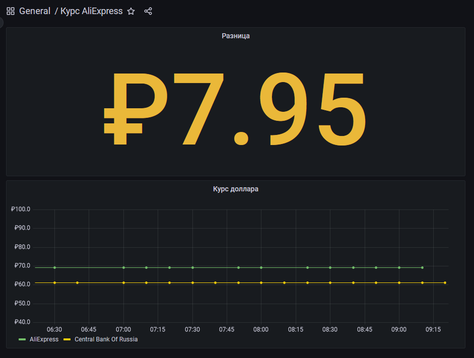

# MetricAliexpressExchangeRate

[](https://github.com/serega404/MetricAliexpressExchangeRate/blob/main/LICENSE)

Экспортер курса Aliexpress и ЦБ РФ

Для сбора метрик я использую [Victoria Metric](https://github.com/VictoriaMetrics/VictoriaMetrics) в режиме CSV

Особая благадарность сайту [cbr-xml-daily.ru](https://cbr-xml-daily.ru) за предоставление данных с сайта [cbr.ru](https://cbr.ru)

### Запуск через Cron

``` Cron
*/10 * * * * python3 /home/bots/KursExporter/main.py
```

### Отображение в Grafana

Файл для импорта: [grafana.json](./grafana.json)



### Запуск в Docker

``` Docker
docker run -d --name MetricAliexpressExchangeRate \
    --restart=always \
    -e METRIC_SERVER_URL='http(s)://<IP_ADDR>:<PORT>/' \
    ghcr.io/serega404/metricaliexpressexchangerate:main
```

#### Дополнительные переменные среды:
* `CBRF_APISITE_URL`
* `ALI1USD_PAGE_URL`

### Библиотеки

* [Requests](https://requests.readthedocs.io/en/latest/)
* [BeautifulSoup](https://www.crummy.com/software/BeautifulSoup/)

### Лицензия

Распространяется под MIT License. Смотри файл [`LICENSE`](./LICENSE) для того что бы узнать подробности.
